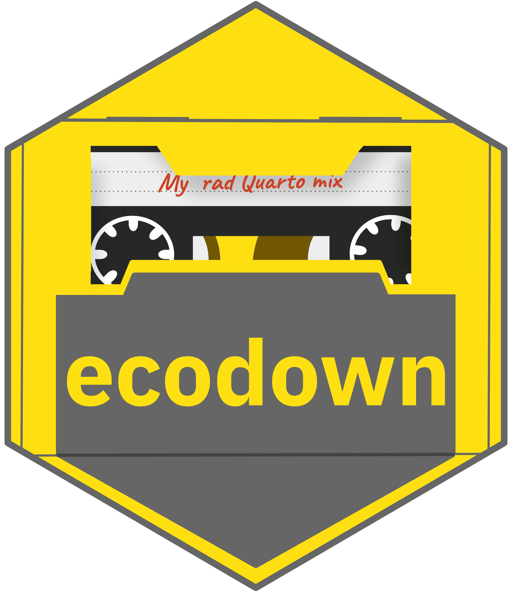

<!-- README.md is generated from README.Rmd. Please edit that file -->

```{r, include = FALSE}
knitr::opts_chunk$set(
  collapse = TRUE,
  comment = "",
  fig.path = "man/figures/README-",
  out.width = "100%"
)

library(fs)

cat_tree <- function(x, ...) {
  t <-  capture.output(dir_tree(x, ... = ...))
  t[[2]] <- paste0(" ", t[[2]])
  cat(purrr::map_chr(t[2:length(t)], ~ paste0(.x, "\n")))  
}

```

# ecodown 

<!-- badges: start -->
[](https://github.com/edgararuiz/ecodown/actions)
[](https://lifecycle.r-lib.org/articles/stages.html#experimental)
[](https://CRAN.R-project.org/package=ecodown)
<!-- badges: end -->

The goal of `ecodown` is to make it possible for your R package's documentation to
be published in a Quarto site.  

The vision for `ecodown` is that it is used to document a group of related packages
that will be published to a single Quarto site.  

## Installation

You can install the development version of `ecodown` from [GitHub](https://github.com/) with:

``` r
# install.packages("devtools")
devtools::install_github("edgararuiz/ecodown")
```


 
 
 