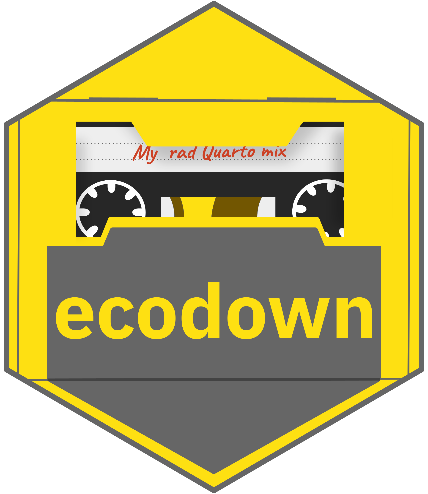

<!-- README.md is generated from README.Rmd. Please edit that file -->

# ecodown 

<!-- badges: start -->

[](https://github.com/edgararuiz/ecodown/actions)
[](https://lifecycle.r-lib.org/articles/stages.html#experimental)
[](https://CRAN.R-project.org/package=ecodown)
<!-- badges: end -->

## A bit of history

### Before Quarto

The [spark.rstudio.com](https://spark.rstudio.com/), and
[tensorflow.rstudio.com](https://tensorflow.rstudio.com/) websites were
initially built in Hugo, via `blogdown`. They used custom R scripts to
build the reference sections. Those scripts used `pkgdown` to build the
bare HTML files. This method worked to an extend, but it was highly
manual. Because website’s repository is not the same as the package’s
repository it documents, we would have to manually clone and then run
the update scripts. There was no easy GitHub Action that would update
all of the reference pages automatically.

### Moving to Quarto

Moving [spark.rstudio.com](https://spark.rstudio.com/), and
[tensorflow.rstudio.com](https://tensorflow.rstudio.com/) to Quarto
presented some challenges, and opportunities:

-   Unlike Hugo, Quarto does not accept HTML as input files, and
    `pkgdown` only produces HTML output. We needed a way to create the
    reference index, and reference pages in a format that Quarto
    accepts.

-   This was an opportunity to move away from custom R scripts. We
    decided to create a package to centralize the code needed to update
    the site.

-   We also wanted to automate the entire cloning, update, and rendering
    process within a GitHub Action script.

## Introducing `ecodown`

`ecodown`’s mechanics are very similar to `pkgdown`. At the end of the
day, your entire site should be able to be updated by calling a single
function, in this case that function is `ecodown_build()`. That function
reads the `_ecodown.yml` file to know what packages to clone, convert,
and render. The idea is that you should be able to run that function
within a GitHub Action to automate.

The package contains other functions are should be useful while
developing your website. `ecodown_convert()` is the function that will
read the folder with a given package is cloned, and then copy/converts
the README, NEWS, articles and help to the proper location. The function
contains many arguments that allow a lot of customization regarding
target folder, commit to use as the source, and whether specific
documents should be copied/converted.

## Should I use `ecodown`?

| Use case                                                                                                                                             | Recommendation | Reason                                                                                                                                                                                                                                                                                    |
|------------------------------------------------------------------------------------------------------------------------------------------------------|----------------|-------------------------------------------------------------------------------------------------------------------------------------------------------------------------------------------------------------------------------------------------------------------------------------------|
| I want to switch my package’s documentation from RMarkdown to Quarto. I already have a working `pkgdown` site.                                       | No             | As long as the **output of the Quarto** README, NEWS and vignettes is set to **Markdown**, then everything should work. `pkgdown` should be able to use the resulting Markdown files. For CRAN publication, make sure to add the `qmd` extensions to your package’s `.Rbuildignore` file. |
| I built a website with `blogdown` (or another Hugo based package), and now want to migrate to Quarto. My one website is the hub for several packages | Yes!           | `ecodown` can help automate updating all of the documents sourced from your package(s).                                                                                                                                                                                                   |

## Installation

You can install the development version of `ecodown` from
[GitHub](https://github.com/) with:

``` r
# install.packages("devtools")
devtools::install_github("edgararuiz/ecodown")
```
